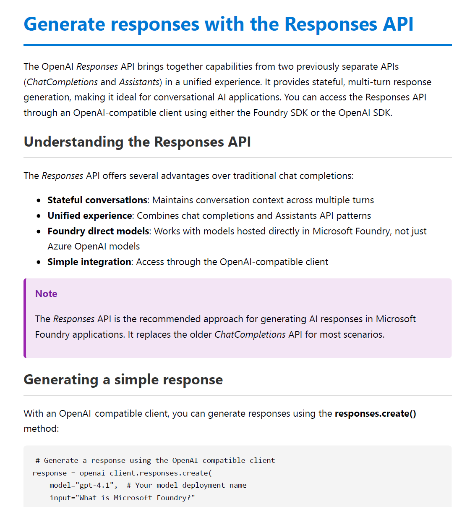

# Microsoft Courses Downloader

> *"Because clicking through 47 tiny units isn't learning—it's a workout for your mouse finger."*

---

## Why this tool exists

It’s 2 AM. Your Azure AI-102 exam is in three days. You’re on Microsoft Learn, clicking through 12 modules full of tiny units—each a separate page. Tabs pile up, progress vanishes, and that paragraph you read yesterday? Lost somewhere between Computer Vision and NLP.

Microsoft Learn is great for bite-sized, month-long strolls. For actual studying, searching, or offline reading it’s a click-maze designed by a button enthusiast.

So I built a tool that stitches all those scattered micro-units into a single, searchable HTML or PDF file per module—all the content, zero clicking, fully offline.

Now go pass that exam.

---

## What It Does

Microsoft Courses Downloader is a Python tool that pulls content from Microsoft Learn courses and converts them into organized, readable documents.

- **Course Extraction**: Fetches learning paths and modules from any Microsoft Learn course URL
- **Catalog API Integration**: Uses the official Microsoft Learn Catalog API for accurate course structure
- **Content Processing**: Extracts and cleans main content from course pages
- **HTML Generation**: Creates beautifully formatted, combined HTML files for each module
- **PDF Conversion**: Converts HTML files to PDF using Playwright
- **Organized Output**: Generates structured output with numbered directories and files

---

## Sample Output



---

## Prerequisites

- **Python 3.8 or higher** - [Download Python](https://www.python.org/downloads/)

---

## Installation

### 1. Clone the Repository

```bash
git clone https://github.com/MidnightFlux/microsoft-courses-downloader.git
cd microsoft-courses-downloader
```

### 2. Set Up Virtual Environment (Recommended)

Creating a virtual environment keeps dependencies isolated from your system Python.

#### Windows (PowerShell)

```powershell
# Create virtual environment
python -m venv .venv

# Activate virtual environment
.venv\Scripts\Activate.ps1
```

> **Note**: If you get an execution policy error, run: `Set-ExecutionPolicy -ExecutionPolicy RemoteSigned -Scope CurrentUser`

#### Windows (Command Prompt)

```cmd
# Create virtual environment
python -m venv .venv

# Activate virtual environment
.venv\Scripts\activate.bat
```

#### macOS / Linux

```bash
# Create virtual environment
python3 -m venv .venv

# Activate virtual environment
source .venv/bin/activate
```

### 3. Install Dependencies

With the virtual environment activated (you should see `(.venv)` in your prompt):

```bash
pip install -r requirements.txt
```

### 4. Install Playwright Browsers

Playwright requires browser binaries for PDF generation:

> **Linux users**: Run this command first to install system dependencies:
> ```bash
> playwright install-deps
> ```

```bash
playwright install chromium
```

---

## Usage

### Running the Script

1. **Activate your virtual environment** (if not already active):
   - **Windows**: `.venv\Scripts\Activate.ps1` (or `activate.bat`)
   - **macOS/Linux**: `source .venv/bin/activate`

2. **Run the script**:

   ```bash
   python main.py
   ```

3. **Enter a course URL** when prompted, or press Enter to use the default (AI-102T00):

   ```
   Enter the Microsoft Learn course URL (press Enter to use default: https://learn.microsoft.com/en-us/training/courses/ai-102t00):
   > 
   ```

### Finding Course URLs

Browse all available Microsoft Learn courses at:  
**https://learn.microsoft.com/en-us/training/browse/?resource_type=course**

Copy any course URL and paste it when prompted.

---

## Example Output Structure

```
output/
├── course-title/
│   ├── 01-learning-path-name/
│   │   ├── 01-module-name.html
│   │   ├── 01-module-name.pdf
│   │   ├── 02-module-name.html
│   │   └── 02-module-name.pdf
│   ├── 02-learning-path-name/
│   │   ├── 01-module-name.html
│   │   ├── 01-module-name.pdf
│   │   └── ...
│   └── ...
└── ...
```

---

## 🎓 Study Tips

Want to supercharge your learning? Upload the generated PDFs to **[Google NotebookLM](https://notebooklm.google.com)**!

NotebookLM is an AI-powered research assistant that can:
- 🎙️ **Generate Podcasts** - Create AI-generated audio summaries you can listen to on the go
- ❓ **Create Quizzes** - Generate practice questions to test your understanding
- 🃏 **Build Flashcards** - Make study cards for quick review sessions
- 💬 **Answer Questions** - Ask questions about the course content and get instant answers
- 🔗 **Connect Ideas** - Discover relationships between different concepts in the material

Simply upload the PDF files generated by this tool to NotebookLM, and start exploring your course content in new, interactive ways!

---

## How It Works

1. **Catalog Fetching**: The script fetches course data from the Microsoft Learn Catalog API
2. **Learning Path Discovery**: Extracts all learning paths associated with the course
3. **Module Processing**: For each learning path, discovers all modules
4. **Unit Extraction**: Fetches all unit links within each module
5. **HTML Generation**: Combines all units into a single, styled HTML file per module
6. **PDF Conversion**: Uses Playwright to convert HTML files to PDF format

---

## Configuration

Default constants can be modified in `main.py`:

```python
DEFAULT_COURSE_URL = "https://learn.microsoft.com/en-us/training/courses/ai-103t00"
OUTPUT_BASE_DIR = "output"
PAGE_TITLE_IGNORE = ("Knowledge check", "Module assessment", "Exercise - ")
```

---

## Requirements

- Python 3.8+
- requests
- beautifulsoup4
- playwright

---

## License

MIT License
